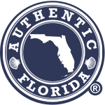
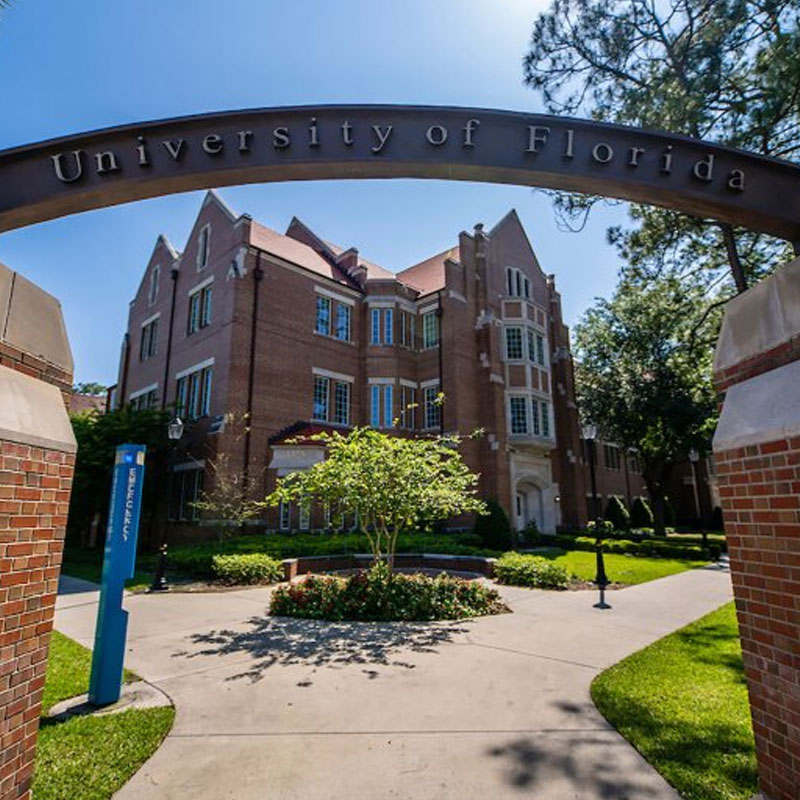
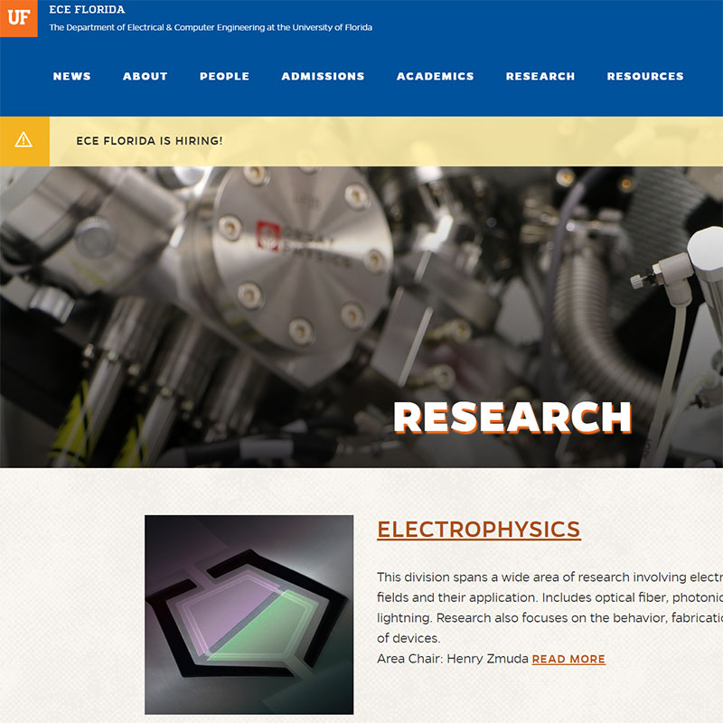

Part of the Electrical and Computer Engineering Department at the University of Florida.

Our research areas are **computer vision** and **computational photography.**

### **The Florida Optics and Computational Sensor Lab** is part of the Electrical and Computer Engineering Department at the University of Florida.

#### Our research areas are **computer vision** and **computational photography.**

### Exploring the intersection of computing and light

## Exploring the intersection of computing and light

[layerslider id="1" /]

[layerslider id="4" /]

### University of Florida Gainesville FL

## University of Florida - Gainesville FL

[layerslider id="3" /]

##### [10 BEST Restaurants](https://authenticflorida.com/10-best-restaurants-in-gainesville/)

##### [Explore Gainesville](https://www.visitgainesville.com/explore/)

##### [Weather in Gainesville](https://weather.com/weather/tenday/l/Gainesville+FL?canonicalCityId=60abec507069aebac1e447d90076e4b6b558e78de143c7ab0a0dec3d482870fc)

##### [University of Florida](https://www.ufl.edu/)

##### [ECE Department](https://www.ece.ufl.edu/)
