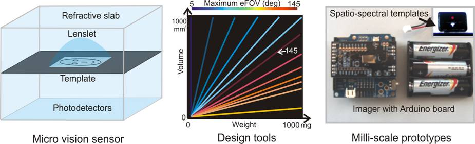
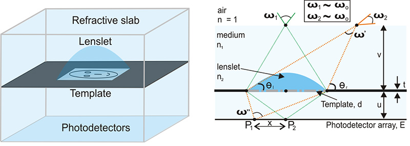
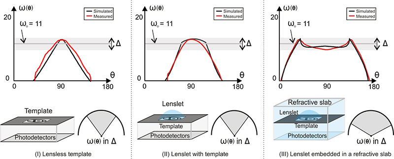
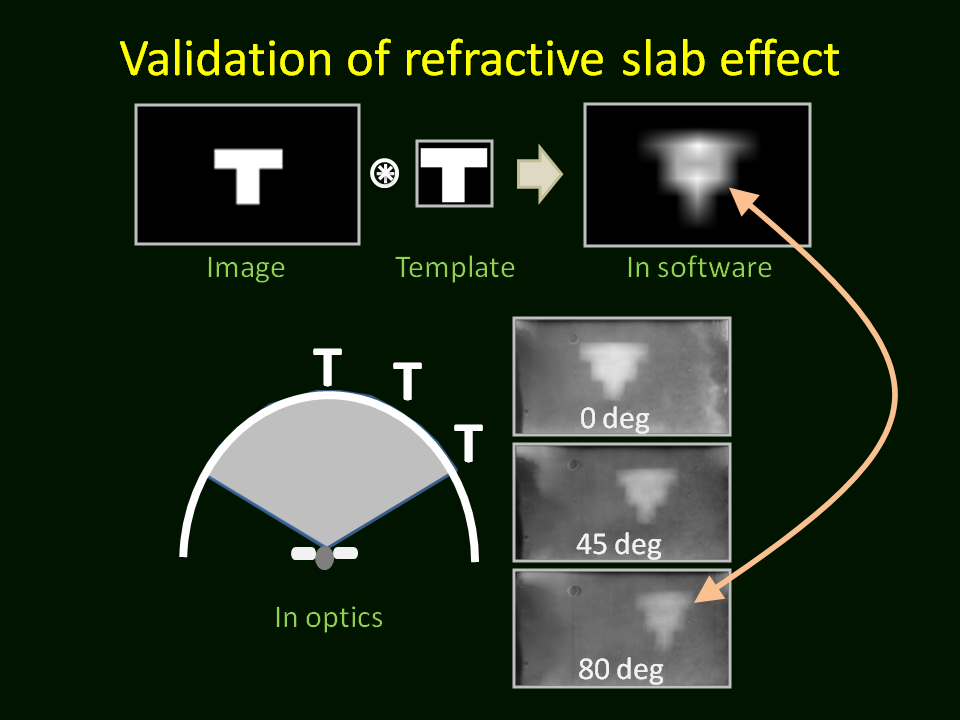
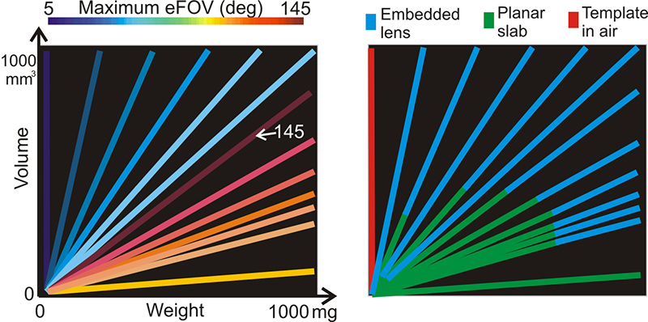
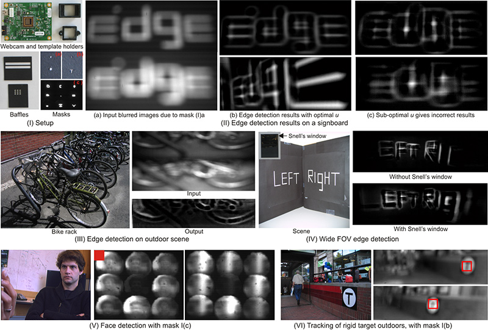
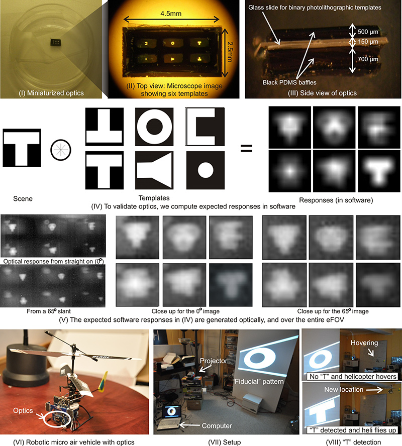
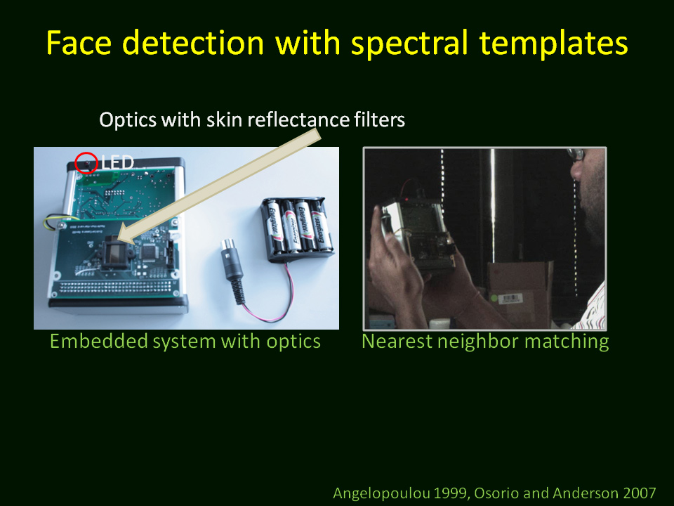

# Wide-angle Micro Sensors for Vision on a Tight Budget

Achieving computer vision on micro-scale devices is a challenge. On these platforms, the power and mass constraints are severe enough for even the most common computations (matrix manipulations, convolution, etc.) to be difficult. This paper proposes and analyzes a class of miniature vision sensors that can help overcome these constraints. These sensors reduce power requirements through template-based optical convolution, and they enable a wide field-of-view within a small form. We describe the trade-offs between the FOV, volume, and mass of these sensors and provide tools to navigate the design space. We demonstrate milli-scale prototypes for computer vision tasks such as locating edges, tracking targets, and detecting faces.

PAPERS: "Wide-angle Micro Sensors for Vision on a Tight Budget" S J. Koppal, I. Gkioulekas, T. Zickler and G. Barrows Accepted to IEEE Conference on Computer Vision and Pattern Recognition (CVPR) June, 2011 [PDF](https://focus.ece.ufl.edu/wp-content/uploads/2023/04/WideAngleMicro_CVPR2011.pdf)

PRESENTATION: "Wide-angle Micro Sensors for Vision on a Tight Budget" Oral presentation at CVPR 2011 | [PPT](https://focus.ece.ufl.edu/wp-content/uploads/2023/04/wide_angle_microCV.pptx)

CODE: Building a lookup table:  [Code](https://focus.ece.ufl.edu/wp-content/uploads/2023/04/build_lookup_table.zip)

SUPPLEMENTARY MATERIAL: A few additional derivations:  [PDF](https://focus.ece.ufl.edu/wp-content/uploads/2023/04/Supplementary_material.pdf)

## Pictures:

### Optical design

These figures depict a lenslet embedded in a refractive slab and placed over an attenuating template. For clarity we analyze a 2D figure, but since the optics are radially symmetric our arguments hold in three dimensions. Each location on the photodetector array defines a single viewing direction and collects light from the scene over the angular support. In our analysis we are particularly interested in the sensor's effective field-of-view (eFOV) , which is the range of viewing directions over which the variation in the template's angular support is lower than a user-defined error threshold. We depict a single sensing element, with the understanding that for any practical application a functioning sensor will be assembled by tiling these elements .

### Experimental validation

Simulated and measured angular support graphs for lensless sensors, lenslets in air and embedded lenslet sensors. Below each graph are drawings of the design and the eFOV. Note the high eFOV of the embedded lens with the refractive slab.

### Visual validation of refractive slab's wide eFOV

A simple auto-correlation operation is performed on a binary \`\`T" image in software. The result is similar to what is produced optically, when the scene and template are both binary \`\`T" patterns. In particular, the template response is consistent (although slightly distorted) even when the target approaches an 80 degree tilt to the viewing normal.

### An instance of our design tool

To help design a sensor that conforms to a particular micro-platform's constraints, we produce a look up table whose entries are Weight, Volume and eFOV. In the figure, we project an example (Volume, Weight, eFOV) look-up table onto the Volume-Weight plane, by only plotting the maximal eFOV at each plane coordinate. Note that design parameters with the same eFOV form one-dimensional spaces (lines). However, more than one configuration can create the same eFOV, as shown by the masks on the right, which color-code the optical designs. The design variations in this figure are best viewed in color.

### Applications

In part (I) of the figure, we show our setup: a camera with custom template holders. We use template I(a) to obtain two blurred versions of the scene, as in II(a). This allows edge detection through simple subtraction as in II and III. Without our optimal parameters, the edge detection is unreliable II(c). Wide-FOV edge detection is possible with a Snell's window enhanced template shown in (IV). In (V), mask I(c) was learnt from a face database, and the nine mask responses are used by a linear classifier to provide face detection. In (VI) we show rigid target tracking using mask I(b), which includes two templates.

### Miniaturized optics demonstrated on a micro air vehicle

We show our optics in a sample container and also in close-up in under a microscope. This is a lensless design with templates embedded in a refractive slab. The templates were arbitrarily selected and created by photolithographic techniques with a resolution of 1 micron. We show the expected responses of convolution of these templates with a \`\`T" target, calculated in software. We validate our optics by showing the optical filtering responses are consistent over a wide field-of-view. Also, we show the setup, from CentEye, of an autonomous micro helicopter, with our optics and our sensor attached. We are able to recognize simple patterns such as the \`\`T" target, and differentiate it from an \`\`O" target and change location based on the type of target. A full video is available in the video section at the end of this website.

### Instances of milli-scale designs

We show three design examples: a lensless design, a lensless design in a refractive slab, and a lenslet in a refractive slab.

### Toward multi-spectral templates

Selecting templates for micro-sensors is challenging. Only a few number of templates can be used, resulting in difficulties when dealing with scale and rotation. In addition, templates can only have positive values and do not allow any brightness compensation (such as normalized cross-correlation). Finally, templates are physically printed and therefore have noise which distorts the desired pattern. Despite these drawbacks, templates have the singular advantage of being manufactured to custom specification: they can filter any part of the visual field. A single micro sensor can therefore have UV, IR and visual templates. Here we show a proof-of-concept that uses skin reflectance filters to help with recognizing faces.

## Videos:

https://focus.ece.ufl.edu/wp-content/uploads/2023/09/cvpr_video.mov

### CVPR 2011 Video

This video is a compilation of the main results of this project.

https://focus.ece.ufl.edu/wp-content/uploads/2023/09/trackingcut.mov

### An Arduino based 8-bit tracker

We put together a vision tracker for a simple T-target based on the Arduino platform. We used a low-power imager from CentEye Inc along with custom optics that we designed and built. Since this design utilizes a refractive slab, it tracks the target over a 160 degree view of the scene. Performing convolution on this 8-bit platform in real time would be very challenging, and therefore our design enables this demonstration.

https://focus.ece.ufl.edu/wp-content/uploads/2023/09/helidemo1.mov

### Proof-of-concept fiducial detection on an autonomous helicopter

We show a demonstration of target detection and tracking using our miniaturized optics and fly our sensor on an autonomous micro air vehicle. This video shows an experiment where we detect a \`\`T" target, and differentiate it from an \`\`O" target. Once the target is detected, the helicopter changes location (flies upward).

https://focus.ece.ufl.edu/wp-content/uploads/2023/09/sanface.mov

### Face detection with background subtraction

https://focus.ece.ufl.edu/wp-content/uploads/2023/09/facenearest.mov

### Face detection with skin filters and nearest neighbor matching
