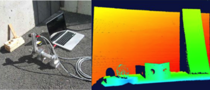

# Low-Power Structured Light

We develop miniature low-power structured light devices using commercially available MEMS mirrors and lasers. Without complex re-engineering, we show how to exploit the high-speed MEMS mirror motion and laser light-sources to solve a range of visual tasks including reconstruction of outdoor scenes in bright sunlight and extreme wide-angle scene reconstruction. Additionally, for each device, we explore design and fabrication trade-offs in terms of power, size, speed and stability.

### Low-Power Structured Light in the Outdoors

We introduce a compact structured light device that utilizes a commercially available MEMS mirror-enabled hand-held laser projector. Without complex re-engineering, we show how to exploit the projector’s high-speed MEMS mirror motion and laser light-sources to suppress ambient illumination, enabling low-cost and low-power reconstruction of outdoor scenes in bright sunlight. We discuss how the line- striping acts as a kind of “light-probe”, creating distinctive patterns of light scattered by different types of materials. We investigate visual features that can be computed from these patterns and can reliably identify the dominant material characteristic of a scene, i.e. where most of the objects consist of either diffuse (wood), translucent (wax), reflective (metal) or transparent (glass) materials.

PAPERS: PAMI 2013 – [MKSN-PROCAMS12](./mksn-procams12.pdf)

### Wide-Angle Structured Light

Microelectromechanical (MEMS) mirrors have extended vision capabilities onto small, low-power platforms. However, the field-of-view (FOV) of these MEMS mirrors is usually less than 90◦ and any increase in the MEMS mirror scanning angle has design and fabrication trade-offs in terms of power, size, speed and stability. Therefore, we need techniques to increase the scanning range while still maintaining a small form factor. In this paper we exploit our recent breakthrough that has enabled the immersion of MEMS mirrors in liquid. While allowing the MEMS to move, the liquid additionally provides a “Snell’s window” effect and enables an enlarged FOV (≈ 150◦). We present an optimized MEMS mirror design and use it to demonstrate applications in extreme wide-angle structured light.

PAPERS: OMN 2017 – [Compact MEMS-based Wide-Angle Optical Scanner](/2017-OMN-compact-mems-scanner.pdf) OMN 2016 – [MEMS Mirrors Submerged in Liquid for Wide-Angle Scanning](/2016-OMN-immersed-mems-mirrors.pdf) Optics Express 2016 – [Wide-angle structured light with a scanning MEMS mirror in liquid](/2016-OpticsExpress-wide-angle-structured-light.pdf) IEEE Transducers 2015 – [MEMS Mirrors Submerged in Liquid for Wide-Angle Scanning](/2015-Transducers-mems-mirrors-submerged.pdf)
