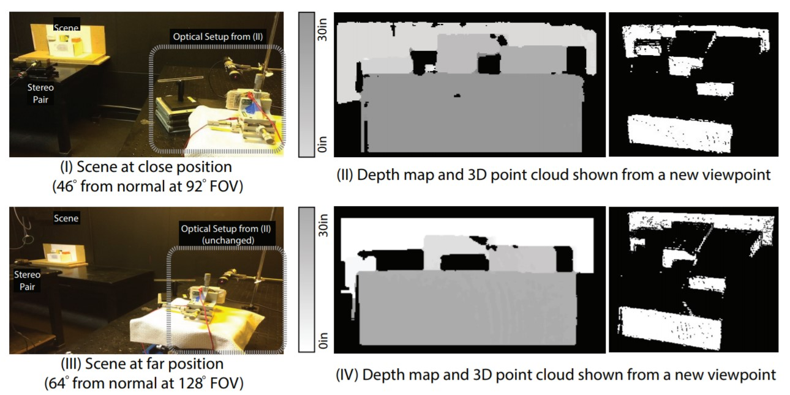

# Adaptive Depth Sensing

Recovering scene geometry is an important research problem in robotics. More recently time-of-flight (TOF) depth sensors have transformed robot perception as these sensors modulate scene illumination and extract depth from time-related features in the reflected radiance, such as phase change or temporal delays. Commercially available TOF sensors such as the Microsoft Kinect and the Velodyne Puck, have influenced fields such as autonomous cars, drone surveillance and wearable devices. Creating TOF sensors for personal drones, VR/AR glasses, IoT nodes and other miniature platforms would require transcending the energy constraints due to limited battery capacity. We demonstrate new efficiencies that are possible with angular control of a TOF sensor. We demonstrate this with a single LIDAR beam reflected off a microelectromechanical (MEMS) mirror. Our designs provide a new frame work to exploit directional control for depth sensing in an adaptive manner for applications relevant to small robotic platforms. We also present an optimized MEMS mirror design and use it to demonstrate applications in extreme wide-angle structured light.

### Directionally Controlled TOF Ranging for Mobile Sensing Platforms

Zaid Tasneem, Dingkang Wang, Huikai Xie, Sanjeev J. Koppal RSS 2018

https://www.youtube.com/watch?v=6DajCjH0vMI

Scanning time-of-flight (TOF) sensors obtain depth measurements by directing modulated light beams across a scene. We demonstrate that control of the directional scanning patterns can enable novel algorithms and applications. Our analysis occurs entirely in the angular domain and consists of two ideas. First, we show how to exploit the angular support of the light beam to improve reconstruction results. Second, we describe how to control the light beam direction in a way that maximizes a well-known information theoretic measure. Using these two ideas, we demonstrate novel applications such as adaptive TOF sensing, LIDAR zoom, LIDAR edge sensing for gradient-based reconstruction and energy efficient LIDAR scanning. Our contributions can apply equally to sensors using mechanical, opto-electronic or MEMS-based approaches to modulate the light beam, and we show results here on a MEMS mirror-based LIDAR system.

PAPERS: RSS 2018 – [Directionally Controlled TOF Ranging for Mobile Sensing Platforms](/2020-IJRR-adaptive-fovea.pdf) NEMS 2018 – [2-Axis MEMS scanner for Compact 3D Lidar](/2018-NEMS-2-axis-mems-scanner.pdf)

### Wide-angle structured light with a scanning MEMS mirror in liquid

Xiaoyang Zhang, Sanjeev J Koppal, Rui Zhang, et al. Optics Express 2016

Microelectromechanical (MEMS) mirrors have extended vision capabilities onto small, low-power platforms. However, the field-of-view (FOV) of these MEMS mirrors is usually less than 90◦ and any increase in the MEMS mirror scanning angle has design and fabrication trade-offs in terms of power, size, speed and stability. Therefore, we need techniques to increase the scanning range while still maintaining a small form factor. In this paper we exploit our recent breakthrough that has enabled the immersion of MEMS mirrors in liquid. While allowing the MEMS to move, the liquid additionally provides a “Snell’s window” effect and enables an enlarged FOV (≈ 150◦). We present an optimized MEMS mirror design and use it to demonstrate applications in extreme wide-angle structured light.

PAPERS: OMN 2017 – [Compact MEMS-based Wide-Angle Optical Scanner](/2017-OMN-compact-mems-scanner.pdf) OMN 2016 – [MEMS Mirrors Submerged in Liquid for Wide-Angle Scanning](/2016-OMN-immersed-mems-mirrors.pdf) Optics Express 2016 – [Wide-angle structured light with a scanning MEMS mirror in liquid](/2016-OpticsExpress-wide-angle-structured-light.pdf) IEEE Transducers 2015 – [MEMS Mirrors Submerged in Liquid for Wide-Angle Scanning](/2015-Transducers-mems-mirrors-submerged.pdf)
