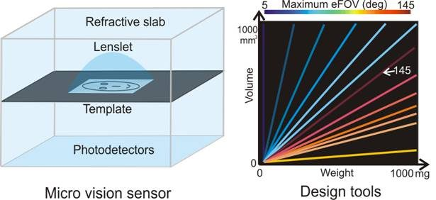

# Wide-Angle MEMS Mirrors and Micro Vision Sensors

Achieving computer vision on micro-scale devices is a challenge. On such devices the mass and power constraints are so severe that even the most common computations are difficult. We introduce and analyze a class of micro-vision sensors and MEMS mirrors that enable a wide field-of-view within a small form. We utilize the “Snell window” effect to enlarge the scan angle of MEMS mirrors by submerging them into liquid whose refraction index is greater than in air, and show micro-vision sensors that reduce power requirements through template-based optical convolution.

### Directionally Controlled TOF Ranging for Mobile Sensing Platforms

Zaid Tasneem, Dingkang Wang, Huikai Xie, Sanjeev J. Koppal RSS 2018

Achieving computer vision on micro-scale devices is a challenge. On such devices the mass and power constraints are so severe that even the most common computations are difficult. We introduce and analyze a class of micro-vision sensors that reduce power requirements through template-based optical convolution, and enable a wide field-of-view within a small form. In this paper we describe the trade-offs between the FOV, volume, and mass of these sensors and provide tools to navigate the design space. We also demonstrate milli-scale prototypes for computer vision tasks such as locating edges, tracking targets, and detecting faces.

PAPERS: PAMI 2013 – [Towards wide-angle micro vision sensors](./pami2013.pdf) CVPR 2011 – [Wide-angle micro sensors for vision on a tight budget](/2011-CVPR-wide-angle-micro-sensors.pdf)

### Wide-Angle MEMS Mirrors

Microelectromechanical (MEMS) mirrors have extended vision capabilities onto small, low-power platforms. However, the field-of-view (FOV) of these MEMS mirrors is usually less than 90◦ and any increase in the MEMS mirror scanning angle has design and fabrication trade-offs in terms of power, size, speed and stability. Therefore, we need techniques to increase the scanning range while still maintaining a small form factor. In this paper we exploit our recent breakthrough that has enabled the immersion of MEMS mirrors in liquid. While allowing the MEMS to move, the liquid additionally provides a “Snell’s window” effect and enables an enlarged FOV (≈ 150◦). We present an optimized MEMS mirror design and use it to demonstrate applications in extreme wide-angle structured light.

PAPERS: OMN 2017 – [Compact MEMS-based Wide-Angle Optical Scanner](/2017-OMN-compact-mems-scanner.pdf) OMN 2016 – [MEMS Mirrors Submerged in Liquid for Wide-Angle Scanning](/2016-OMN-immersed-mems-mirrors.pdf) Optics Express 2016 – [Wide-angle structured light with a scanning MEMS mirror in liquid](/2016-OpticsExpress-wide-angle-structured-light.pdf) IEEE Transducers 2015 – [MEMS Mirrors Submerged in Liquid for Wide-Angle Scanning](/2015-Transducers-mems-mirrors-submerged.pdf)
