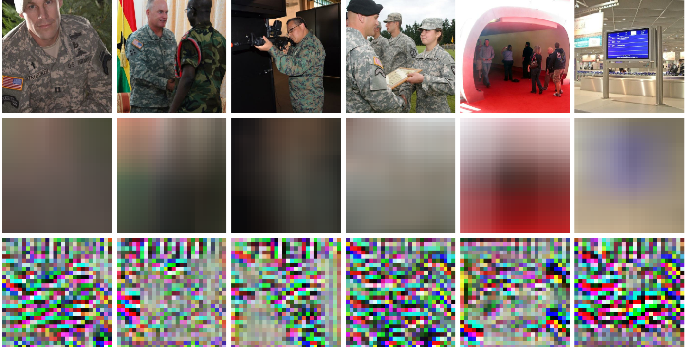

# Privacy Preserving Computational Cameras

Major advances in computer vision and the mobile revolution have set the stage for widespread deployment of connected devices with “always-on” cameras and powerful vision capabilities. While these advances have the potential to enable a wide range of novel applications and interfaces, privacy and security concerns surrounding the use of these technologies threaten to limit the range of places and devices where they are adopted. In this context, we see a resurgence in privacy preserving computer vision research, intended to help mitigate both societal and legal concerns. In this page, we highlight some of our recent work in this area.

### Revealing Scenes by Inverting Structure from Motion Reconstructions

Francesco Pittaluga, Sanjeev J. Koppal, Sing Bing Kang, Sudipta Sinha

https://www.youtube.com/watch?v=M4U9sXE84rY

Many 3D vision systems utilize pose and localization from a pre-captured 3D point cloud. Such 3D models are often obtained using structure from motion (SfM), after which the images are discarded to preserve privacy. In this paper, we show, for the first time, that SfM point clouds retain enough information to reveal scene appearance and compromise privacy. We present a privacy attack that reconstructs color images of the scene from the point cloud. Our method is based on a cascaded U-Net that takes as input, a 2D image of the points from a chosen viewpoint as well as point depth, color, and SIFT descriptors and outputs an image of the scene from that viewpoint. Unlike previous SIFT inversion methods, we handle highly sparse and irregular inputs and tackle the issue of many unknowns, namely, SIFT keypoint orientation and scale, image source, and 3D point visibility. We evaluate our attack algorithm on public datasets (MegaDepth and NYU Depth V2) and analyze the significance of the point cloud attributes. Finally, we synthesize novel views to create compelling virtual tours of scenes.

PAPERS: [PVPR 2019](https://arxiv.org/pdf/1904.03303.pdf)

### Learning Privacy Preserving Encodings through Adversarial Training

Francesco Pittaluga, Sanjeev J. Koppal, Ayan Chakrabarti

We present a framework to learn privacy-preserving encodings of images to inhibit inference of a chosen private attribute. Rather than encoding a fixed dataset or inhibiting a fixed estimator, we aim to to learn an encoding function such that even after this function is fixed, an estimator with knowledge of the encoding is unable to learn to accurately predict the private attribute, when generalizing beyond a training set. We formulate this as adversarial optimization of an encoding function against a classifier for the private attribute, with both modeled as deep neural networks. We describe an optimization approach which successfully yields an encoder that permanently limits inference of the private attribute, while preserving either a generic notion of information, or the estimation of a different, desired, attribute. We experimentally validate the efficacy of our approach on private tasks of real-world complexity, by learning to prevent detection of scene classes from the Places-365 dataset.

PAPERS: [PDF](https://focus.ece.ufl.edu/wp-content/uploads/2023/04/wacv-20191.pdf)

### Pre-capture Privacy for Small Vision Sensors

Francesco Pittaluga, Sanjeev J. Koppal

https://www.youtube.com/watch?v=JmDfbMMuWao

The next wave of micro and nano devices will create a world with trillions of small networked cameras. This will lead to increased concerns about privacy and security. Most privacy preserving algorithms for computer vision are applied after image/video data has been captured. We propose to use privacy preserving optics that filter or block sensitive information directly from the incident light-field before sensor measurements are made, adding a new layer of privacy. In addition to balancing the privacy and utility of the captured data, we address trade-offs unique to miniature vision sensors, such as achieving high-quality field-of-view and resolution within the constraints of mass and volume. Our privacy preserving optics enable applications such as depth sensing, full-body motion tracking, people counting, blob detection and privacy preserving face recognition. While we demonstrate applications on macro-scale devices (smartphones, webcams, etc.) our theory has impact for smaller devices.

PAPERS: [PAMI 2017](https://focus.ece.ufl.edu/wp-content/uploads/2023/05/precapture_privacy_for_small_vision_sensors.pdf) [CVPR 2015](https://focus.ece.ufl.edu/wp-content/uploads/2023/05/paper_privacy_preserving_optics_for_miniature_vision-sensors.pdf) [Presentation](https://focus.ece.ufl.edu/wp-content/uploads/2023/05/presentation_privacy_preserving_optics_for_miniature_vision-sensors.pdf)

### Sensor-level Privacy for Thermal Cameras

Francesco Pittaluga, Aleksandar Zivkovic, Sanjeev J. Koppal

https://www.youtube.com/watch?v=xEpOkyo2beI

As cameras turn ubiquitous, balancing privacy and utility becomes crucial. To achieve both, we enforce privacy at the sensor level, as incident photons are converted into an electrical signal and then digitized into image measurements. We present sensor protocols and accompanying algorithms that degrade facial information for thermal sensors, where there is usually a clear distinction between humans and the scene. By manipulating the sensor processes of gain, digitization, exposure time, and bias voltage, we are able to provide privacy during the actual image formation process and the original face data is never directly captured or stored. We show privacy-preserving thermal imaging applications such as temperature segmentation, night vision, gesture recognition and HDR imaging

PAPERS: [ICCP 2016](https://focus.ece.ufl.edu/wp-content/uploads/2023/05/sensor_level_privacy_for_thermal_cameras.pdf) [Presentation](https://focus.ece.ufl.edu/wp-content/uploads/2023/05/presentation_sensor_level_privacy_for_thermal-cameras.pdf)
