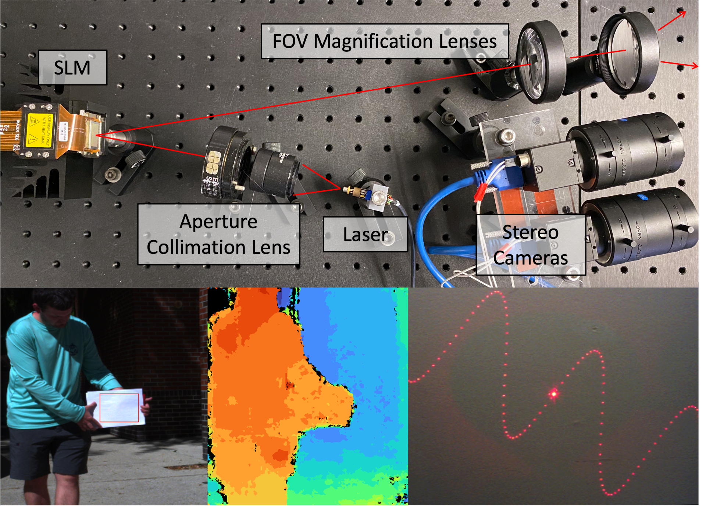

## Energy-Efficient Adaptive 3D Sensing

##### **Brevin Tilmon1, Zhanghao Sun2, Sanjeev Koppal1, Yicheng Wu3,
Georgios Evangelidis3, Ramzi Zahreddine3, Guru Krishnan3, Sizhuo Ma3, Jian Wang3
**University of Florida1, Stanford University2, Snap Inc.3

_Active depth sensing achieves robust depth estimation but is usually limited by the sensing range. Naively increasing the optical power can improve sensing range but induces eye-safety concerns for many applications, including autonomous robots and augmented reality. In this paper, we propose an adaptive active depth sensor that jointly optimizes range, power consumption, and eye-safety. The main observation is that we need not project light patterns to the entire scene but only to small regions of interest where depth is necessary for the application and passive stereo depth estimation fails. We theoretically compare this adaptive sensing scheme with other sensing strategies, such as full-frame projection, line scanning, and point scanning. We show that, to achieve the same maximum sensing distance, the proposed method consumes the least power while having the shortest (best) eye-safety distance. We implement this adaptive sensing scheme with two hardware prototypes, one with a phase-only spatial light modulator (SLM) and the other with a micro-electro-mechanical (MEMS) mirror and diffractive optical elements (DOE). Experimental results validate the advantage of our method and demonstrate its capability of acquiring higher quality geometry adaptively._

[Full Text](https://focus.ece.ufl.edu/wp-content/uploads/2023/08/CVPR_2023_Energy_Efficient_Adaptive_3D_Sensing.pdf)

[GitHub code](https://github.com/btilmon/holoCu)

[PROJECT PAGE](https://btilmon.github.io/e3d.html)

