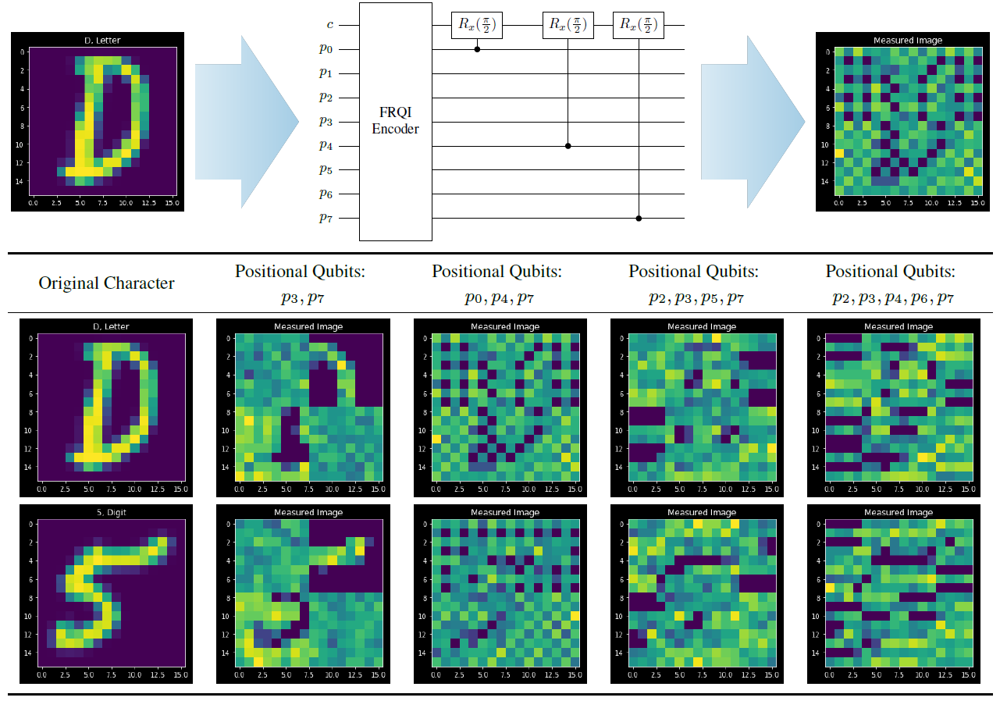

## Schrödinger’s Camera: First Steps Towards a Quantum-Based Privacy Preserving Camera

##### **Hannah Kirkland and Sanjeev J. Koppal**

_Privacy-preserving vision must overcome the dual challenge of utility and privacy. Too much anonymity renders the images useless, but too little privacy does not protect sensitive data. We propose a novel design for privacy preservation, where the imagery is stored in quantum states. In the future, this will be enabled by quantum imaging cameras, and, currently, storing very low resolution imagery in quantum states is possible. Quantum state imagery has the advantage of being both private and non-private till the point of measurement. This occurs even when images are manipulated, since every quantum action is fully reversible. We propose a control algorithm, based on double deep Q-learning, to learn how to anonymize the image before measurement. After learning, the RL weights are fixed, and new attack neural networks are trained from scratch to break the system's privacy. Although all our results are in simulation, we demonstrate, with these first steps, that it is possible to control both privacy and utility in a quantum-based manner._

[Full Text](https://openaccess.thecvf.com/content/CVPR2023W/TCV/html/Kirkland_Schrodingers_Camera_First_Steps_Towards_a_Quantum-Based_Privacy_Preserving_Camera_CVPRW_2023_paper.html)

[GitHub code](https://github.com/teawizardry/schrodingers-camera)

[Poster](./poster.pdf)

<iframe src="https://share.descript.com/embed/F4Z6N2GhvvJ" width="680" height="400" frameborder="0" allowfullscreen="allowfullscreen"></iframe>

