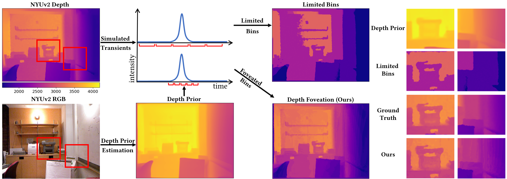

## FoveaSPAD: Exploiting Depth Priors for Adaptive and Efficient Single-Photon 3D Imaging

##### **Justin Folden1,  Atul Ingle**2**, Sanjeev Koppal1** University of Florida1, Portland State University2

_Fast, efficient, and accurate depth-sensing is important for safety-critical applications such as autonomous vehicles._ _Direct time-of-flight LiDAR has the potential to fulfill these demands, thanks to its ability to provide high-precision depth measurements at long standoff distances._ _While conventional LiDAR relies on avalanche photodiodes (APDs), single-photon avalanche diodes (SPADs) are an emerging image-sensing technology that offer many advantages such as extreme sensitivity and time resolution._ _In this paper, we remove the key challenges to widespread adoption of SPAD-based LiDARs: their susceptibility to ambient light and the large amount of raw photon data that must be processed to obtain in-pixel depth estimates._ _We propose new algorithms and sensing policies that improve signal-to-noise ratio (SNR) and increase computing and memory efficiency for SPAD-based LiDARs._ _During capture, we use external signals to \emph{foveate}, i.e., guide how the SPAD system estimates scene depths._ _This foveated approach allows our method to \`\`zoom into'' the signal of interest, reducing the amount of raw photon data that needs to be stored and transferred from the SPAD sensor, while also improving resilience to ambient light. We show results both in simulation and also with real hardware emulation, with specific implementations achieving a 1548-fold reduction in memory usage, and our algorithms can be applied to newly available and future SPAD arrays._

[Full Text](https://focus.ece.ufl.edu/wp-content/uploads/2024/12/FoveaSPAD_TCI_2024.pdf)
