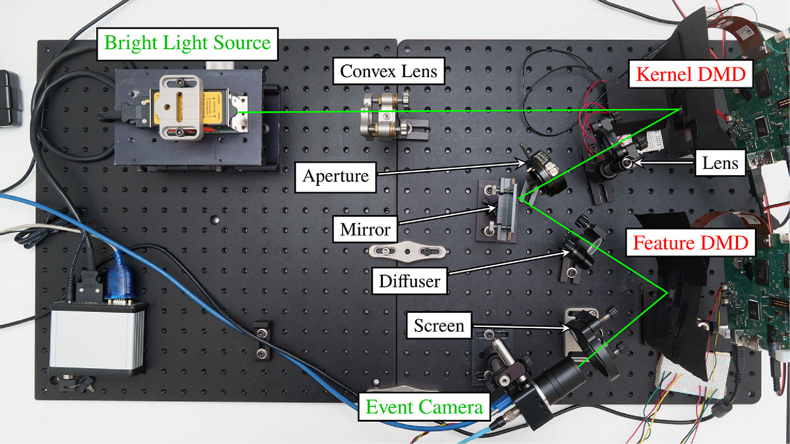

## Non-Fourier Event-Based Opto-electronic Convolution Accelerator

**Hannah Kirkland, Trung H. Le, Piper Taylor, Mehran Keivanimehr, Isaac J. Sledge, and Sanjeev J. Koppal**

_The current advancement of neural networks has led to a resurgence of research in optical computing. Exploiting the physical properties of light to enable optical neural networks is advantageous due to optical computing’s higher parallelism, speed, and power consumption compared to conventional compute methods. However, many state-of-the-art methods rely on coherent light and conventional image sensors or photodetectors. For the first time, to the best of our knowledge, we demonstrate using an event camera for reconfigurable optical compute, implemented via a neuromorphic camera, light source, two digital micromirror devices (DMDs), and a computer. We describe the fundamental advantages and limitations of our device, then report initial results using the device for two simple machine learning tasks._

[Full Text (PDF)](./paper.pdf)

[Optics Express (Open Access)](https://doi.org/10.1364/OE.584235)

