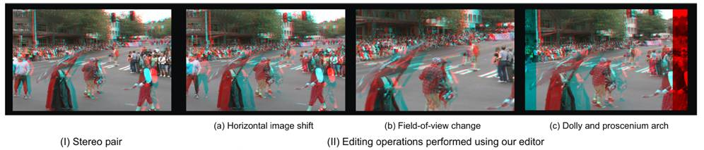

# Editing Stereoscopic Content

A digital editor provides the timeline control necessary to tell a story through film. Current technology, although sophisticated, does not easily extend to 3D cinema because stereoscopy is a fundamentally different medium for expression and requires new tools. We formulated a mathematical framework for use in a viewer-centric digital editor for stereoscopic cinema driven by the audience's perception of the scene. Our editing tool implements this framework and allows both shot planning and after-the-fact digital manipulation of the perceived scene shape. The mathematical framework abstracts away the mechanics of converting this interaction into stereo parameters, such as interocular, field of view, and location. We demonstrate cut editing techniques to direct audience attention and ease scene transitions. User studies were performed to examine these effects.

PAPERS: "A Viewer-centric Editor for Stereoscopic Cinema" S J. Koppal, L. Zitnick, M. Cohen, S. B. Kang, B. Ressler and A. Colburn Accepted to IEEE Computer Graphics and Applications (IEEE CGA) (to appear)  [PDF](https://focus.ece.ufl.edu/wp-content/uploads/2023/04/stereoscopy.pdf)

Thanks to Zeyu Wang for pointing out some errata ([see PDF](https://focus.ece.ufl.edu/wp-content/uploads/2023/04/ZWang-Discussion-on-Stereovision-Formulae.pdf)).  Zeyu also created a cool demo for people to see how our equations change perceived stereo (Demo).

**2010 Video (use Apple Quicktime 6.0):** This video is a compilation of the main results of this project.

**User studies (use Apple Quicktime 6.0):** These are the videos shown to viewers in our studies.
