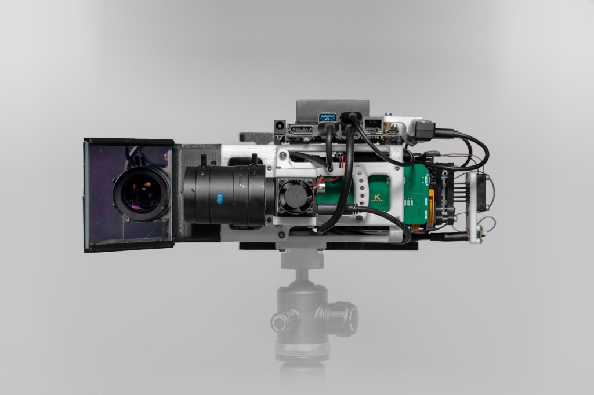
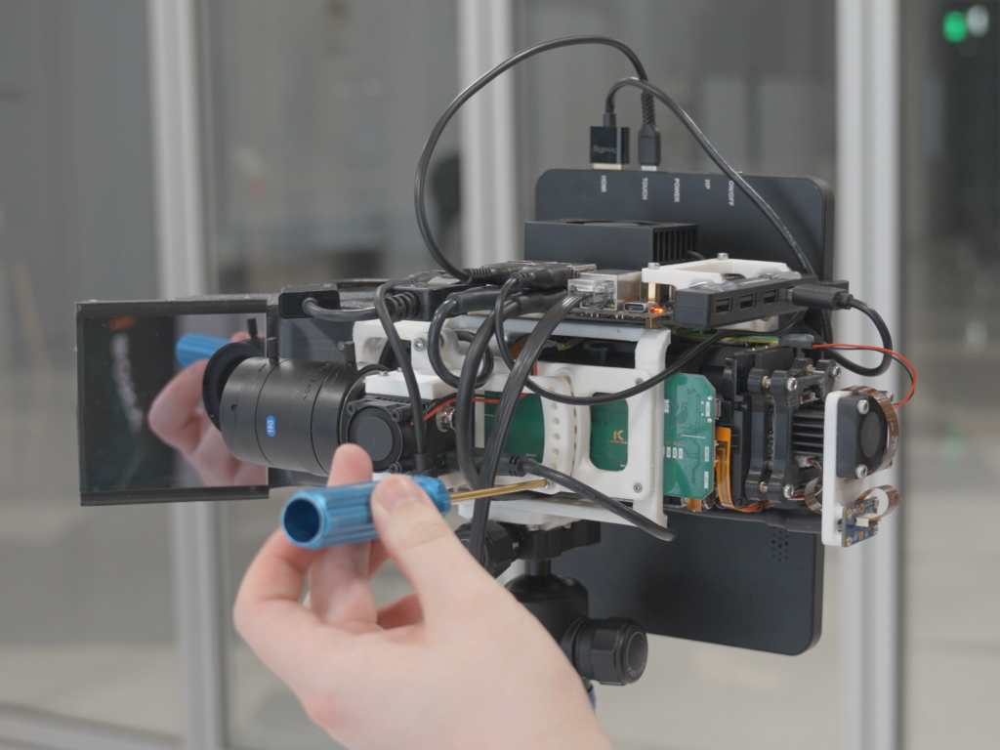

## FoveaCam++: Systems-Level Advances for Long Range Multi-Object High-Resolution Tracking

##### Yuxuan Zhang and Sanjeev J. Koppal [Full Text (PDF)](https://focus.ece.ufl.edu/wp-content/uploads/2024/08/IROS-FoveaCamPlus.pdf)  |  [Poster](https://focus.ece.ufl.edu/wp-content/uploads/2024/10/Poster.V2.A0.pdf)  |  IROS 2024

 

UAVs and other fast moving robots often need to keep track of distant objects. Conventional zoom cameras commit to a particular viewpoint, and carrying multiple zoom cameras for multi-object tracking is not feasible for power limited robotic systems. We present a dual camera setup that allows tracking of multiple targets at nearly 1km distance with high-resolution. Our setup includes a wide angle camera providing a conventional resolution view and a MEMS driven zoom camera that can query a specific region within the wide angle camera (WAC). We built and calibrated the two-camera system and implemented a real-time image fusion pipeline. We show multi-object tracking and stabilization in real world scenarios.

<iframe width="560" height="315" style="position: absolute; width: 100%; height: 100%; left: 0; top: 0;" title="Introduction video" src="https://www.youtube.com/embed/GR6qlshd_Xw?si=Py5H7mJp2YE_BN32" frameborder="0" allowfullscreen="allowfullscreen"></iframe>
