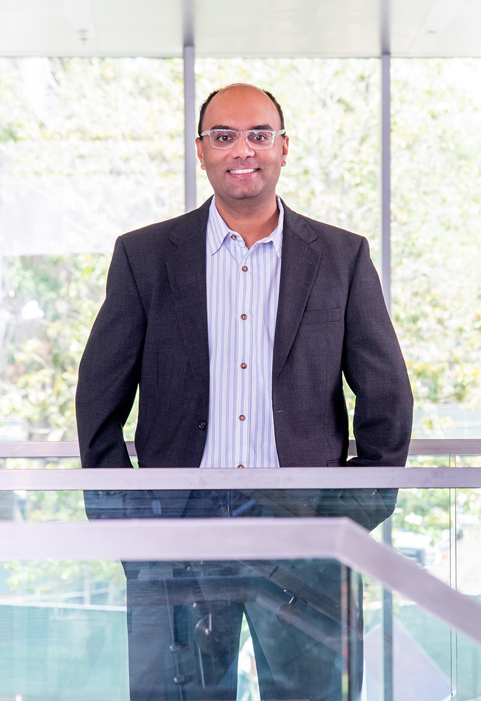
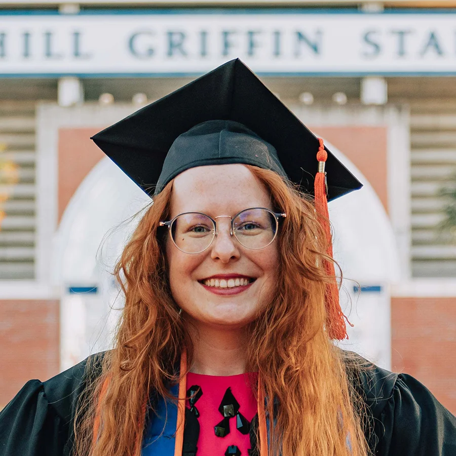
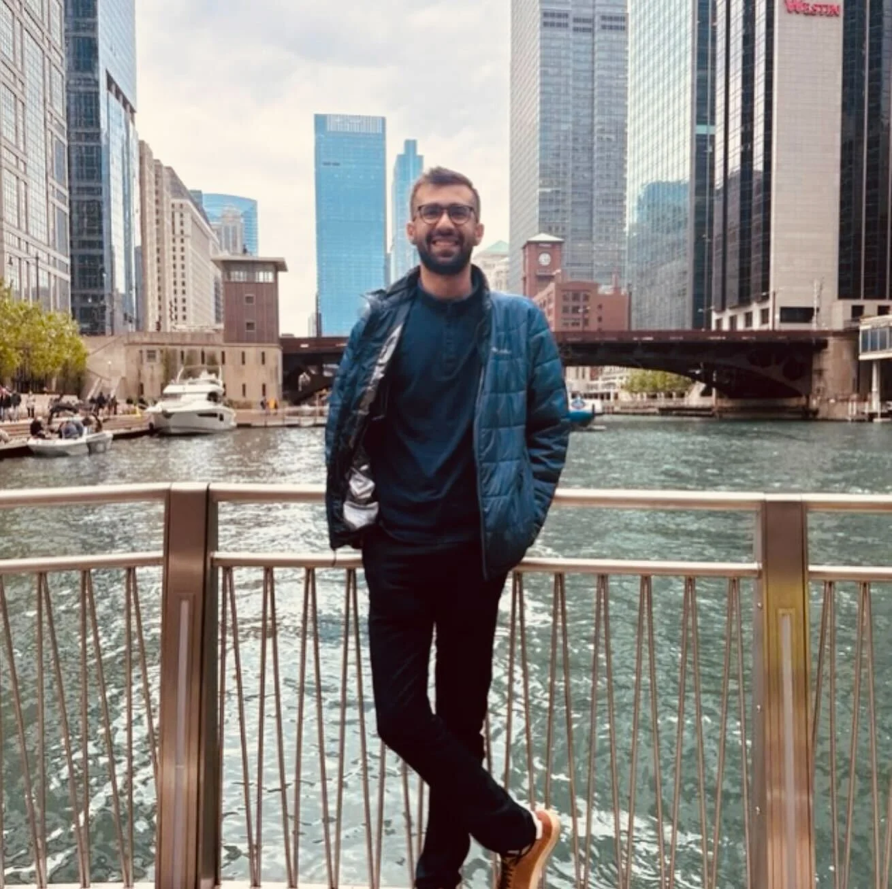
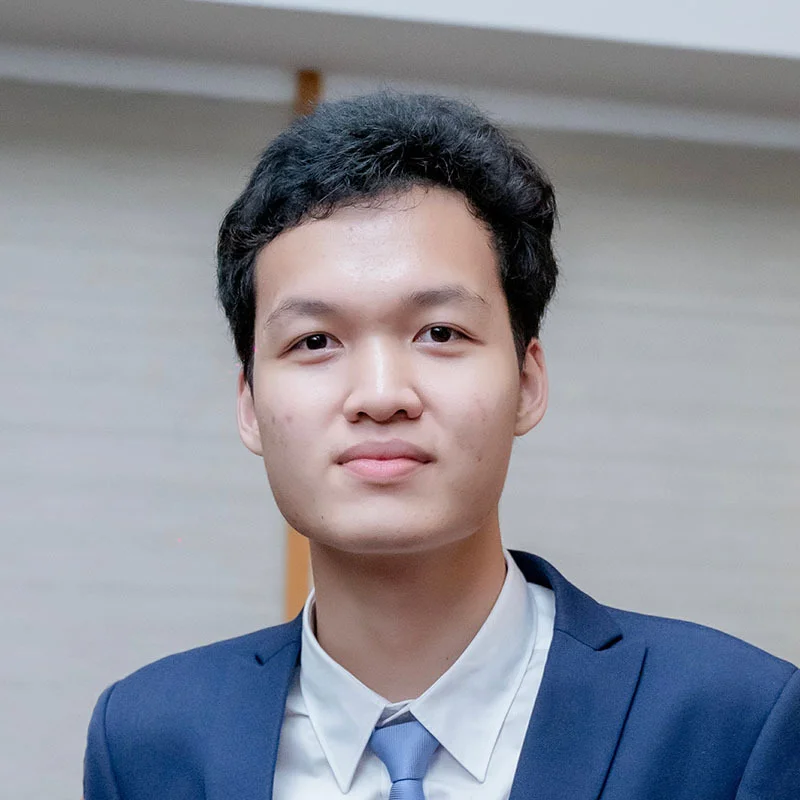
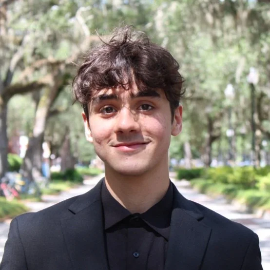
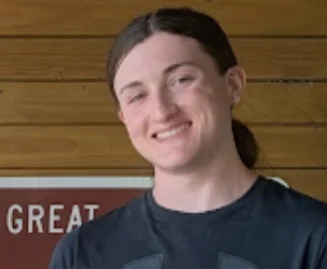

## Principal Investigator

### Dr. Sanjeev Koppal

Sanjeev J. Koppal is an Associate Professor at the University of Florida’s Electrical and Computer Engineering Department and is a Kent and Linda Fuchs Faculty Fellow. He also held a UF Term Professorship for 2021-23. Sanjeev is the Director of the FOCUS Lab at UF. Since 2022, Sanjeev has been an Amazon Scholar with Amazon Robotics. Prior to joining UF, he was a researcher at the Texas Instruments Imaging R&D lab. Sanjeev obtained his Masters and Ph.D. degrees from the Robotics Institute at Carnegie Mellon University. After CMU, he was a postdoctoral research associate in the School of Engineering and Applied Sciences at Harvard University. He received his B.S. degree from the University of Southern California in 2003 as a Trustee Scholar. He is a co-author on best student paper awards for ECCV 2016 and NEMS 2018, and work from his FOCUS lab was a CVPR 2019 best-paper finalist. Sanjeev won an NSF CAREER award in 2020 and is an IEEE Senior Member and an Optica Senior Member. His interests span computer vision, computational photography and optics, novel cameras and sensors, 3D reconstruction, physics-based vision, and active illumination.

[Dr. Koppal’s CV](https://focus.ece.ufl.edu/wp-content/uploads/2024/11/Sanjeev_Koppal_CV.pdf)

sjkoppal@ece.ufl.edu 352-392-8942 MALA 5103

## Ph.D Students

### Hannah Kirkland

Hannah is a graduate research assistant in the FOCUS Lab. They graduated with a B.S in Electrical Engineering from UF in 2021. Their interests include computational photography, unconventional computing, and computer vision.

hkirkland@ufl.edu

### Yuxuan Zhang

Yuxuan earned his Bachelor’s degree in Physics from Xi’an Jiao Tong University and is currently pursuing a PhD at the University of Florida. His interdisciplinary expertise includes _Software Engineering_ (Web Dev, Computer Vision, Concurrent Programming, Machine Learning, Linux Deployment and Maintenance), _Electrical Engineering_ (HDL Languages, ISA Emulators, PCB Prototyping, Embedded Systems Development and Communication Protocols), and _Mechanical Engineering_ (CAD Tools, Robotic Mechanisms, 3D Printing and many other CNC manufacturing technologies). His current research focuses on _foveated vision systems_.

zhangyuxuan@ufl.edu | [Website](https://zhangyx.net/)

### Michael Tomadakis

Michael is a 2024 Computer Science graduate from the University of Florida. He's been passionate about graphics since discovering shaders in Unreal Engine 3 twelve years ago, but his interests have matured into Computer Vision and Neural Rendering. He is working on NeRF stitching and adjacent techniques.

m.tomadakis@ufl.edu | [resume](https://focus.ece.ufl.edu/wp-content/uploads/2024/05/Michael_Tomadakis_2024_Data-ML.pdf)

### Jacob Carter

Jacob graduated from Louisiana State University in 2024 with a B.S. in Computer Science. He is interested in AI, Machine Learning, and Computer Vision.

carterjacob@ufl.edu

### Mehran Keivanimehr

Mehran earned a B.S. in Electrical and Computer Engineering from the University of Kashan. His academic interests span artificial intelligence, machine learning, deep learning, and computer vision.

m.keivanimehr@ufl.edu.

### Thiago Cuevas

Thiago Cuevas holds a Bachelor’s degree in Control and Automation Engineering from the Universidade Federal de Uberlândia, Brazil, and is currently pursuing a Ph.D. in Electrical Engineering at the University of Florida. Prior to joining the FOCUS Lab, he worked in research and development in Robotics, Computer Vision, and Embedded Systems, having experience in both software and hardware design. His current research focuses on collision prediction algorithms and computational imaging.

tcuevasmestanza@ufl.edu. | [GitHub](https://github.com/thiagofcm) | [LinkedIn](< https://www.linkedin.com/in/thiago-cuevas/>)

## Undergraduate Students

### Trung Le

Trung is a Undergraduate Junior student majoring in Electrical Engineering. His research interests include computational photography and optical computing.

trung.le@ufl.edu

### Ajna Topic

Ajna is a Sophomore Computer Engineering Student at UF. She is interested in microcontrollers, robotics, and optics.

ajnatopic@ufl.edu

### Rebecca Borissova

Rebecca Borissova is an undergraduate student at the University of Florida majoring in Computer Science. Her research interests include Machine Learning, Computer Vision, and Neural Radiance Fields.

rborissova@ufl.edu

### Noah Ralph

Noah Ralph is an undergraduate student at the University of Florida majoring in Electrical Engineering. His interests include 3D printing, Biomechanics, Robotics, and Medical Devices.

na.ralph@ufl.edu

### Elvin Hernandez

Elvin Hernandez is an undergraduate student at the University of Florida majoring in Electrical Engineering. His research interests include machine learning, MEMS integration and embedded systems, optics/optical computing, and signal processing.

hernandez.e1@ufl.edu

### Marcel Bossa

Marcel Bossa is a sophomore majoring in computer engineering. His research interests include Computer Vision and Computational Photography.

marcelbossa@ufl.edu

### Dillon Gutowski

Dillon is an undergraduate Computer Science student at the University of Florida. He is interested in algorithm design and applied mathematics, light transport simulation, embedded systems, dual photography, and Raman spectroscopy.

dillongutowski@ufl.edu

### Logan Burns

Logan Burns is an undergraduate student at the University of Florida majoring in Electrical Engineering. Their research interests include embedded systems, printed circuit board design, robotics, optical sensing, and mixed-signal circuits. 

lburns1@ufl.edu

## Alumni

### Doctoral Students

[Justin Folden](https://jfolden.github.io/) Thesis: Foveated Depth Sensing (2024)

[Brevin Tilmon](http://btilmon.github.io) - Quidient Thesis:  Foveated Computational Imaging (2023)

Xiaomeng Liu Thesis: Lightweight Light Transport for Non-line-of-sight Imaging (2022)

Dingkang Wang – Texas Instruments Thesis: Quasi-static Scanning and Monolithic Forward Scanning Electrothermal MEMS Mirrors for LIDAR (2021)

Kristofer Henderson – Lockheed Martin Thesis: Sensor Fusion for Non-Line-of-Sight Visualization and Imaging (2020)

[Francesco Pittaluga](https://www.francescopittaluga.com/) – NEC Labs Thesis: Privacy Preserving Computational Cameras (2019)

Xiaoyang Zhang (PhD co-advised with Dr. Huikai Xie) – Apple Thesis: Robust Electrothermally Actuated Scanner for Fiberoptic Endoscopic Imaging and Wide-angle Optics (2016)

### Master’s and Undergraduate Students

Class of 2025 Piper Taylor - Scientist at Eglin AFB

Class of 2024 Jackson Arnold (MS) Chloe Petrosino (BS) - PhD Candidate at Duke University

Class of 2023 Lianan Armil (BS) Dylan Ogrodowski (BS) – MS student at University of Florida

Class of 2022 Sophia Rossi (BS) – Microsoft Nicolas Laffineuse (BS) – Texas Instruments Gavin St. John (BS)

Class of 2021 TJ Thomas (BS) – PhD candidate at Carnegie Mellon University

Class of 2018 Zaid Tasneem (MS) – PhD candidate at Rice University

Class of 2017 Nahien Chowdhury (BS) – The Boeing Company Tatiana Luna (BS) – MS/PhD candidate at Columbia University Aashik Nagadikeri Harish (MS) – STRIVR Labs

Class of 2016 Aleksandar Zivkovic (MS) – Magic and Company Junior Metayer (BS) – Florida Power and Light Phillip Riley (MS) – Harris Corporation Ishwarya Iyengar Thirunarayanan (MS) – Siemens Imaging

Class of 2015 Elizabeth Butler (MS) – Lockheed Martin
